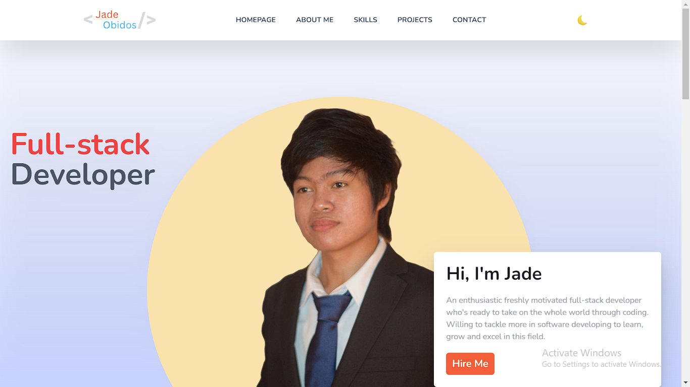

# Jade's-portfolio

### Description

Welcome to my portfolio repository; this is where the brief summary of myself on how I got into coding, the skills that I've learned and acquired through a coding Bootcamp and where also, my compilation of projects is displayed.

This project only uses Tailwind as a CSS framework...

## Available Scripts

In the project directory, you only need to run this in the terminal:

### `npm install`

